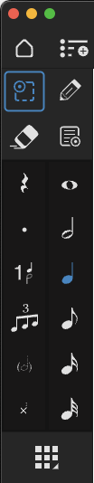
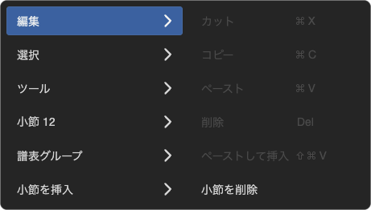
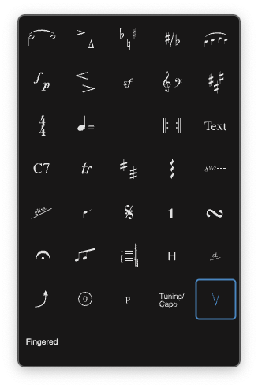
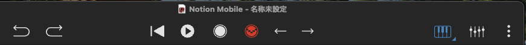
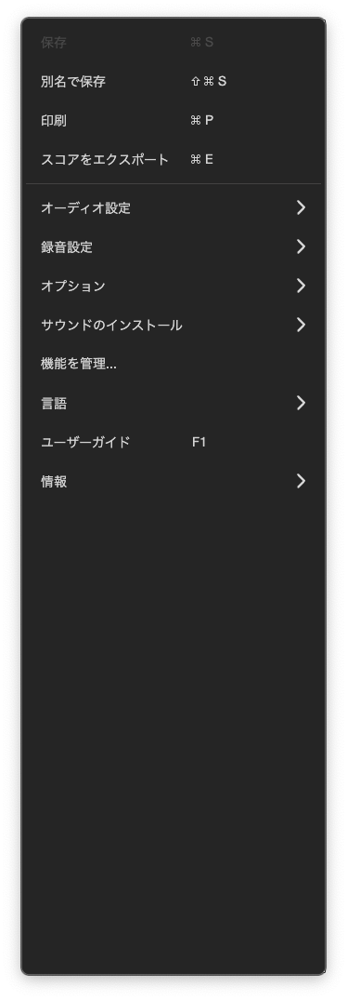
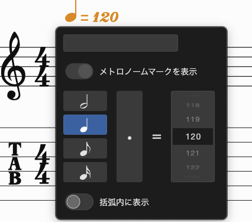
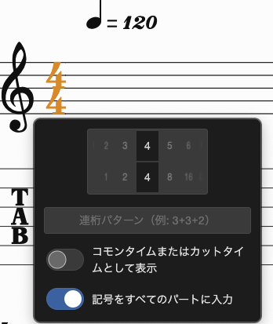

# NotionMobile
|左列|メニューボタン|
|--|--|
|ホームページ（cmd + W） ツールを選択 消去「消しゴム」 休符 付点 ボイス 連符（長押しで切替） 装飾音符 符頭|  
  

|メニューボタン|右列|
|--|--|
||スコアセットアップを表示（cmd + G） 手書き「鉛筆」（有料。アプリ内購入でアンロック） コンテキストメニュー デュレーションメニュー 全音符 ２分音符 ４分音符 ８分音符 １６分音符 ３２分音符 ツールグリッド|

|コンテキストメニュー|コマンド|
|--|--|
||編集（カット、コピー、ペースト、削除、ペーストして挿入、小節を削除） 選択（すべてを選択、すべての選択を解除、パートを選択、コード記号を選択、歌詞を選択、声部１を選択、声部２を選択） ツール（休符で埋める、リズムスラッシュで埋める） 小節１（小節番号を常に表示、小節番号を表示しない、次の小節に連結、通常の小節、弱起小節、不完全小節） 譜表グループ（テンポ情報を表示） 小節を挿入（小節の数、適用）|

|ツールグリッド|コマンド|
|--|--|
||タイ・アーティキュレーション・臨時記号・異名同音・スラー 強弱記号・ヘアピン・強弱のアーティキュレーション・音部記号・キー 拍子・テンポ・小節線・リピート・テキスト コード・トリル・トレモロ・アルペジオ・オクターブ記号 グリッサンド・ジャズベンド・ジャンプ記号・運指・装飾音 一時停止・連桁を編集・楽器変更・ギターテクニック・スライド ベンド・ギター弦・運指（右手）・チューニング・カポ・弦テクニック その他|

|||
|--|--|
||取り消す|
||やり直す|
||速戻し（巻戻す）|
||開始（再生一時停止）（space）|
||リアルタイム録音（cmd + shift + R）|
||ステップ録音（cmd + R）|
||前に戻る|
||次に進む|
||オンスクリーン楽器|
||ミキサー|
||アプリケーションメニュー|
  
  
|アプリケーションメニュー|コマンド|
|--|--|
||保存 別名で保存 印刷 スコアをエクスポート 録音設定 オプション サウンドのインストール 機能を管理 言語 ユーザーガイド 情報|

- パッセージ  
- デュレーション（音符の長さ）  
- ［音符］＞［音符／休符を切り替え］  
- コードアイコン  

## 1.基本
1. テンポを指定
2. 拍子を指定
3. 小節数を指定
  
|No|やりたいこと|操作|メモ|
|--|--|--|--|
|1|テンポ指定|||
|2|拍子指定|||
|3|小節を選択して削除|||

